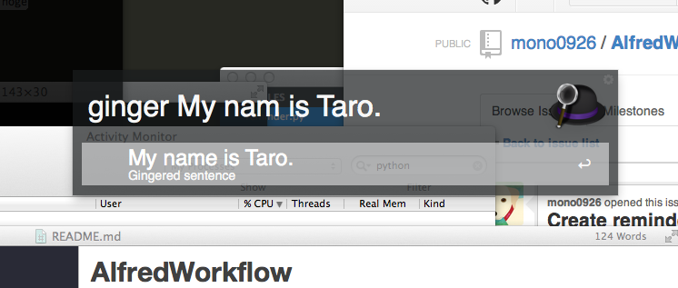
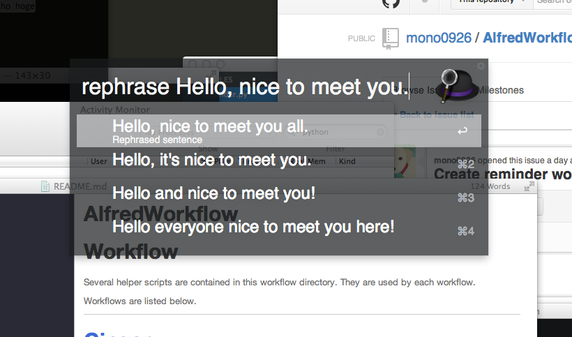
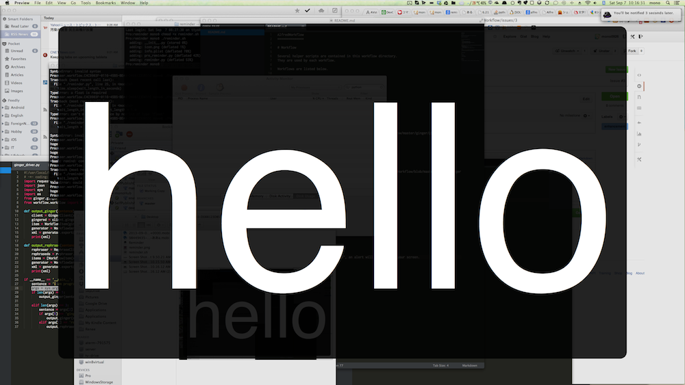

AlfredWorkflow
==============

# Workflow

Several helper scripts are contained in this workflow directory.
They are used by each workflow.

Workflows are listed below.

---

# [Ginger](http://www.getginger.jp/)

## Feature

- [Ginger](http://www.getginger.jp/)
  - Correct a typed sentence in English.
  

- [Rephrase](http://www.gingersoftware.com/rephrase_jpn)
  - Enhance a typed sentence in English.

  
## Install

- [Direct Download](https://github.com/mono0926/AlfredWorkflow/raw/master/ginger/ginger.alfredworkflow)
- Required environment
  - Homebrew python (recommended: version 2.7.5)
  - pip install requests
  - Or, if you modify the script, it would run correctly.

## Build

- Execute [this shell script](https://github.com/mono0926/AlfredWorkflow/blob/master/ginger/ginger.sh), after that, ginger.alfredworkflow will be generated.

---

# GoogleCalendar

TBD

## Feature

- Add a schedule.
- List up schedules.

---

# Reminder

## Feature

- If you type "remind 15 m -m hello", an alert will be shown on your screen.

  

## Install

- [Direct Download](https://github.com/mono0926/AlfredWorkflow/raw/master/reminder/reminder.alfredworkflow)
- Required environment
  - Homebrew python (recommended: version 2.7.5)
  - pip install requests
  - Or, if you modify the script, it would run correctly.

## Build

- Execute [this shell script](https://github.com/mono0926/AlfredWorkflow/blob/master/reminder/reminder.sh), after that, reminder.alfredworkflow will be generated.
